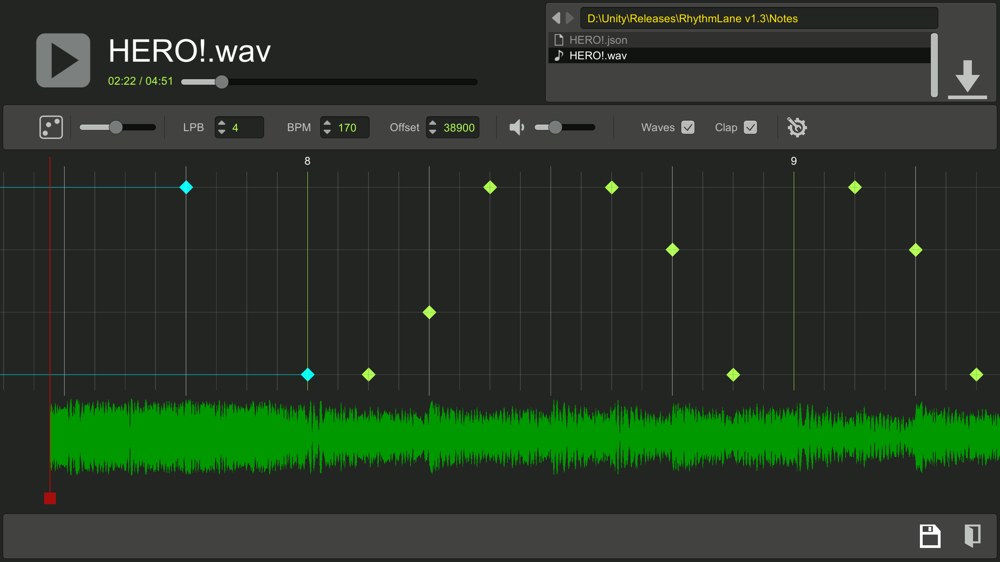

# RhythmLane
[中文版](README_zh.md)  
## Overview
Rhythm game with falling notes (like djmax or osumania) and a corresponding sheet editor. Made with Unity.  
  
**Current issues**    
* There are problems with the holding keys.
* This project may be migrated to Godot.  
    

## Contents
### Note editor
This part of content is from [setchi](https://github.com/setchi/NoteEditor). Thanks a lot for this great work!  
The editor supports:  
* Load .wav music files
* Edit on 2-5 tracks with 2 types of notes (normal and holding note)
* Set the beats and offset
* Save the sheet as .json file    
  

### Gameplay
* Load and play the .json sheet file! An autoplay mode is also available.  
  
  

### Other
Some setting options are provided:
* Resolution and volume
* Key position
* The game delay
* Note falling speed

## How to play
You can download the game and a test sheet (.wav and .json files) in release.  
Or you can open the project with Unity 2022.3.53 f1c1.  

