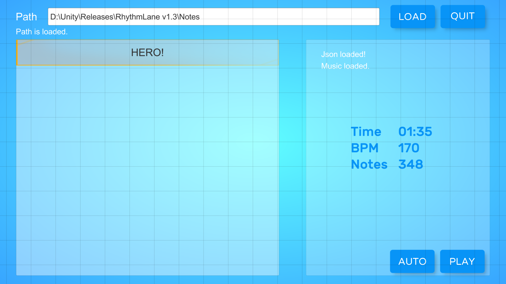

# RhythmLane
[English](README.md)  
## 项目简介
下落式音游及对应的乐谱编辑器。使用Unity及C#开发！  
    

## 内容
### 乐谱编辑器
这部分内容由[setchi](https://github.com/setchi/NoteEditor)的作品改编。感谢这个优质项目！  
目前该编辑器支持：    
* 加载.wav格式音乐文件
* 编辑2-5轨的音游谱面，支持普通和长按两种音符
* 设置乐谱的节奏及延迟
* 将谱面文件保存为.json格式      
  

### 下落式音游
* 将.wav和.json文件放入同一路径下，并在MusicSelect场景选择   
* 提供了自动播放模式    
  
  

### 设置
可以调整并保存以下设置：
* 分辨率，音量及触键音效
* 键位
* 音乐播放延迟
* 音符下落速度

## 使用方法
* 在release中下载应用程序及一个测试用乐谱  
* 或者使用Unity打开项目文件。开发用版本为：2022.3.53 f1c1。 

