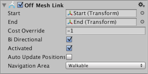

# OffMesh Link

OffMeshLink component allows you to incorporate navigation shortcuts which cannot be represented using a walkable surface. For example, jumping over a ditch or a fence, or opening a door before walking through it, can all be described as OffMesh links.

## Properties

| Property| Function |
|:---|:---|
| **Start** | Object describing the start location of the OffMesh Link. |
| **End** | Object describing the end location of the OffMesh Link. |
| **Cost Override** | If value is positive, use it when calculating path cost on processing a path request. Otherwise, the default cost is used (the cost of the area to which this game object belongs). If the Cost Override is set to the value 3.0, moving over the OffMesh link will be three times more expensive than moving the same distance on a default [**NavMesh**][1] area. The cost override becomes useful when you want to make the agents generally favor walking, but use the OffMesh link when the walk distance is clearly longer. |
| **Bi-Directional** | If enabled, the link can be traversed in either direction. Otherwise, it can only be traversed from _Start_ to _End_. |
| **Activated** | Specifies if this link will used by the pathfinder (it will just be ignored if this is set to false). |
| **Auto Update Positions** | When enabled, the OffMesh link will be reconnected to the NavMesh when the end points move. If disabled the link will stay at its start location even if the end points are moved. |
| **Navigation Area** | Describes the [navigation area type](./AreasAndCosts.md) of the link. The area type allows you to apply a common traversal cost to similar area types and prevent certain characters from accessing the OffMesh Link based on the agent’s Area Mask. |

[1]: ./BuildingNavMesh.md "A mesh that Unity generates to approximate the walkable areas and obstacles in your environment for path finding and AI-controlled navigation."

### Additional resources

- [Creating an OffMesh Link](./CreateOffMeshLink.md) – workflow for setting up an OffMesh link.
- [OffMesh Link scripting reference](https://docs.unity3d.com/ScriptReference/AI.OffMeshLink.html) - full description of the OffMesh Link scripting API.
